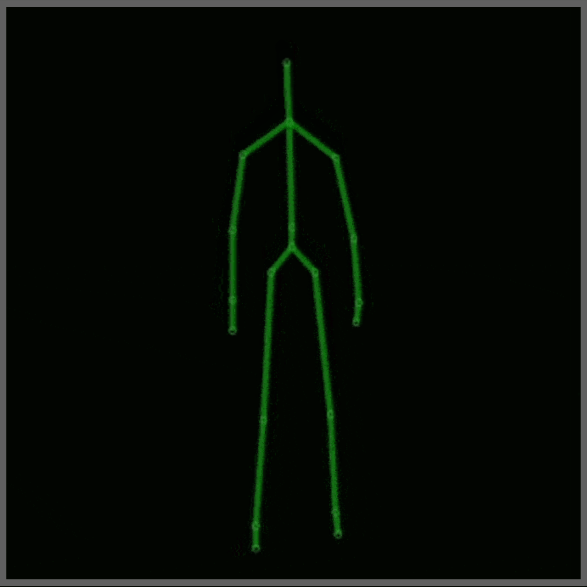
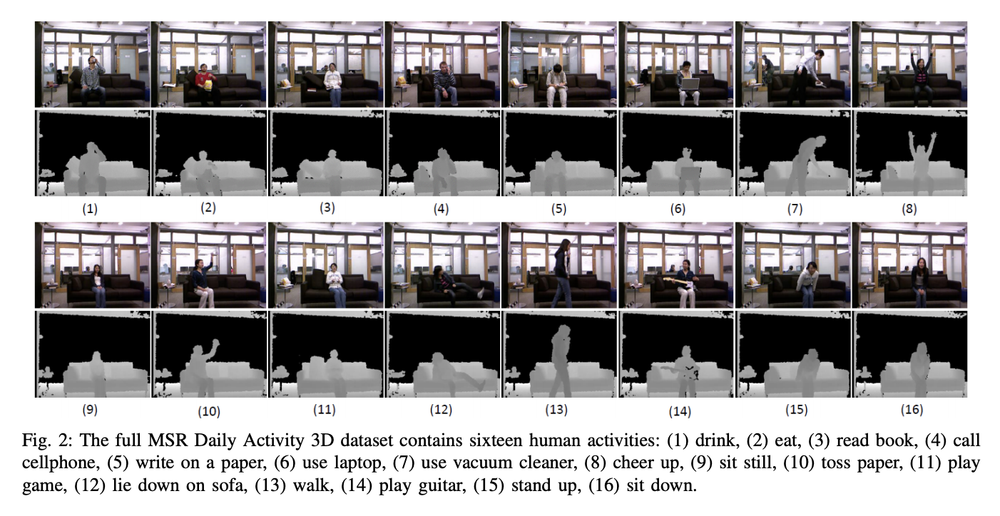

# Application of SVM on RAD & HJPD Skeleton Representations to Classify Certain Human Actions



## About:
- For this project, the "MSR Daily Activity 3D Dataset" (MDA3) was used. This dataset contains 16 human activities gathered from a Xbox Kinetic sensor and stored as skeletons which are just real world, (x, y, z), cooridnate of 20 joints points on a human. To get more information about this dataset, please checkout this link: https://wangjiangb.github.io/my_data.html.
- This project was originally created and submitted during my time as an undergraduate at the Colorado School of Mines. It was during the Spring 2020 semester and it was for Project 3 of my Human Centered Robotics (CSCI473) class. This project was designed to provide us an introduction towards machine learning in robotics though the use of Support Vector Machine(s) (SVM).
- To view the original CSCI473 project description for this project, check out this [LINK](https://inside.mines.edu/~hzhang/Courses/CSCI473-573/Projects/Project-3-Spring2022-D3.pdf)
- The project contains 2 main elements: representation & Classification.
- Representation: The data is represented either in RAD and/or HJPD.
- Classification: The representation is used with SVM, powered by LIBSVM, to create a model and predict human actions.
- This project was modified to act as a library towards converting skeleton data into RAD or HJPD representations and applying SVM to those representations. 

## Results:
-----------------------------------------------------------
- DataType: reps/rad_d2.t
- Accuracy: 62.5%
-----------------------------------------------------------
- DataType: reps/cust_d2.t
- Accuracy: 70.83%
-----------------------------------------------------------

## Setup & Run
0. Initial setup:
    1. Make sure to run on a Unix based operating system (like Linux and/or MacOS).
    2. Make sure to have python3 and pip3 installed.
    3. Make sure to have this project cloned to your local machine.
    4. Make sure your using a terminal.
    5. Make sure your in the same directory as this project after you cloned (it will be assumed from here onwards you did this).
    6. Make sure your using your desired Python environment setup. 
    7. (optional) You might want to update Pip3. To do this, run this command:
        ```
        pip3 install --upgrade pip
        ```
1. Install Python3 libraries:
    ```
    pip3 install -r requirements.txt
    ```
2. Run main script:
    ```
    python3 main.py
    ```
3. Check out the results though the console print outs and/or though the file outputs located in confusion_matrix/

## Notes:
- This project was tested on Python version 3.8.13
- For this project, the complete MDA3 dataset and a modified MDA3 dataset is used. The modified MDA3 only contains acitvities 8, 10, 12, 13, 15, & 16. Also the modified verison has some "corrupted" data points in it well the complete dataset does not.
- The main scripts and the datasets are contained in the tools/ directory.
- Took though and run the main.py script to get an idea of how everything works
- File Exploring:
    - README.md : Project's README.
    - confusion_matrix : Where the confusion matrix of the models are, can be, stored.
    - extra : Just extra/random files/assets.
    - main.py : An example of script of how to use this library.
    - reps : Where the data's representation(s) are, can be, stored.
    - tools : Where the main scripts/function and datasets are stored.
- Actions From MSR DailyActivity 3D Dataset (figure is from [HERE](https://wangjiangb.github.io/my_data.html) but was modified by CSCI473 professor to include actions' numeric id):


## Sources:
- Information About Representations (RAD, HJPD, etc):
    - https://arxiv.org/pdf/1601.01006.pdf

- Information About The Xbox Kinetic Sensor:
    - https://www.youtube.com/watch?v=uq9SEJxZiUg
    - https://medium.com/@lisajamhoury/understanding-kinect-v2-joints-and-coordinate-system-4f4b90b9df16
    - https://en.wikipedia.org/wiki/Kinect
    - https://www.jameco.com/Jameco/workshop/Howitworks/xboxkinect.html#:~:text=Hardware,body%2Dtype%20and%20facial%20features.

- Information About SVM(s) & LibSVM:
    - Installing LIBSVM:
        - https://www.csie.ntu.edu.tw/~cjlin/libsvm/
        - https://pypi.org/project/libsvm/
        - https://github.com/cjlin1/libsvm
    - SVM & LIBSVM Logic & Documentation:
        - https://www.csie.ntu.edu.tw/~cjlin/papers/guide/guide.pdf
        - https://www.csie.ntu.edu.tw/~cjlin/libsvmtools/datasets/

- Information About The Dataset Used/Modifed:
    - https://wangjiangb.github.io/my_data.html
